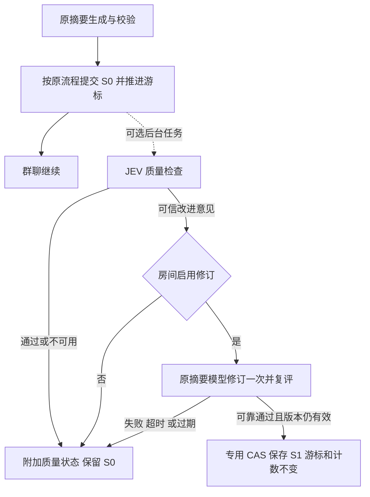

# 群聊与工作流的 JEV 增强规划

状态：待实施。本文只覆盖群聊与工作流，Ekko Agent 已有记忆、技能查找和技能学习不在本次改造范围。

本版按用户最新要求修订：**JEV 是可选增强，关闭、未配置、失败或超时均不能阻断原有业务；不改变既有数据约束与业务链路。** 本版替代此前的强制验收与自动返工方案。新增字段、服务与界面均为规划，尚未实现。

评审核对基线：评审附件使用 `ccf26506a`；本轮规划工作区基于本地 main `7ecfdcf1`，已包含 `6cbf17f0`（Skill JEV，PR #3169），规划初稿提交为 `56cfe85c`。这些是已检查的本地提交，不代表对后续远端 HEAD 的声明。

摘要检查、工作流质量观察和群聊分派使用 **Studio 共享 JEV facade**，不扩展 Ekko Memory JEV 的业务代码，也不依赖某个 Agent 的 memory/skills 开关。

## 1. 必须保持的行为契约

1. 原业务是独立可运行的基线。没有 JEV 时，群聊消息、摘要生成与提交、工作流节点执行、分支、审批和运行结果照常处理。
2. 关闭或无凭据时零 JEV 请求。连接失败、429/5xx、超时、返回格式错误、证据不足、低置信、输入超限均放弃增强，保留基线。
3. “增强不可用”不能伪装成“质量通过”，也不能改成业务失败。界面将业务状态与质量评估分开显示。
4. 权限、原有数据校验、事务、版本检查、消息顺序、幂等和既有业务错误仍由原流程负责。JEV 不能覆盖这些确定性规则。
5. 增强结果只能在其有效对象与版本上使用。超时返回后到达的迟到结果不得继续写入、路由或触发副作用。
6. 用户取消、原任务总 deadline 到期、原业务自身失败继续按原语义处理，不能通过 JEV 的回退吞掉。
7. 增强的排队、诊断、记录和通知失败也不能回滚已经成功的主业务。增强资源有并发和队列上限，满载时跳过。

新功能采用异步旁路：摘要先按原流程提交，工作流按原图继续；随后做质量检查。自动分派只补充本来没有目标的用户消息。这样 JEV 的超时等待不计入原执行链路的必经步骤。

### 1.1 与现有记忆、skill 的关系

本次已核对实现：记忆召回先算原结果，增强失败恢复完整原结果；写入评估失败继续原校验和事务；技能查找失败保留原匹配；学习预检失败继续原完整审查。它们都具有独立时间预算，取消单独传播。

评审第 1 条“当前无 Skill JEV”在 `ccf26506a` 上成立，在本轮基线上已经过时：`scripts/jev-integrations.json` 包含 `ekko-skills`，`packages/ekko-agent/src/skills/jev.ts` 包含语义匹配和学习预检，`tests/ekko-agent/skills-jev.test.ts` 包含故障回退测试。因此保留上述现状描述，并注明版本，不将已存在功能改写为未实现。

开启并获得可信判断时，当前记忆增强可以过滤普通无关记忆或拒绝不合格写入，学习预检可以跳过明确没有学习价值的审查。这些是主动启用的效果，并不等于服务失败导致业务阻断。记忆的存储结构、权限、事务和修订校验仍走原机制；不能把“可选增强”说成启用后输出也完全不变。

## 2. 交付目标与顺序

| 顺序 | 功能 | 用户获得的能力 |
| --- | --- | --- |
| 1 | 群聊摘要检查与可选修订 | 找到遗漏约束、过时结论、无依据的完成声明；有可靠修订时改善现有摘要 |
| 2 | 工作流节点质量观察 | 为节点填写质量标准，运行记录展示逐条判断和已有证据 |
| 3 | 工作流质量建议与人工重跑 | 展示需要改进的条件；用户可以编辑输入并使用已有重跑功能 |
| 4 | 群聊分派推荐 | 用户没有指定 Agent 时，推荐一个符合职责的房间成员 |
| 5 | 群聊自动分派 | 房间显式开启后，为本来没有执行目标的新任务补充分派 |

这些能力属于 Studio 群聊/工作流编排层，可覆盖 Hermes、Ekko Agent 和 Coding Agents。第一版直接增强现有 Agent 节点，不新增 JEV 节点类型。

**不交付 JEV 强制放行节点、不依据 JEV 自动改图或触发返工回环。** 现有成功/失败条件边、人工审批、反馈回环继续按原机制运行。用户以后主动修改工作流属于新的显式操作。

## 3. 已确认的代码边界

| 模块 | 现有实现 | 接入要求 |
| --- | --- | --- |
| 摘要生成与提交 | `packages/server/src/modules/studio/services/group-chat/room-summary.ts` | 保留原触发条件、租约、版本、generation、游标与条件提交；成功提交后再调度增强 |
| 群聊分派和队列 | `packages/server/src/modules/studio/services/group-chat/agent-clients.ts` | 显式 @、handoff、continuation 优先，智能分派复用原 admission 和队列 |
| 群聊存储与事件 | `packages/server/src/modules/studio/sockets/group-chat.ts` | 只做接线，质量与分派判断放独立 service |
| 工作流执行 | `packages/server/src/modules/studio/services/workflow/manager.ts` | 普通 DAG 与回环使用同一评估旁路；评估不介入出边决定 |
| 导入导出 | `packages/server/src/modules/studio/services/workflow/portability.ts` | 显式保存质量配置；兼容旧文件，不把可选质量配置变成运行前置条件 |
| 运行记录 | `packages/server/src/modules/studio/repositories/workflow-run-store.ts` | 附加评估绑定具体 execution 和 iteration，不替换原运行状态 |
| JEV facade | `packages/server/src/modules/studio/public/jev.ts` | 复用共享调用入口，业务模块不各自创建 SDK |

工作流持久化 run 状态仍为 queued/running/completed/failed/canceled。JEV 不引入新的等待、阻塞或失败状态，也不复用 blocked 来表达质量问题。

## 4. 配置与共同执行规则

### 4.1 一个连接入口，三个业务开关

Models → JEV 沿用现有连接信息，在同一页增加群聊摘要、工作流质量、群聊分派三组。新增功能默认关闭，保存 API Key 不会自动启用。

| 拟议 Profile 字段 | 初始默认值 | 含义 |
| --- | --- | --- |
| `groupSummaryReviewEnabled` | false | 开启群聊摘要质量增强 |
| `groupSummaryReviewMinConfidence` | 0.8 | 采纳摘要判断的最低置信值 |
| `groupSummaryReviewTimeoutMs` | 3000 | 一次摘要增强任务的累计 JEV 请求预算 |
| `workflowQualityEnabled` | false | 开启工作流质量观察及建议 |
| `workflowQualityMinConfidence` | 0.8 | 采纳节点质量判断的最低置信值 |
| `workflowQualityTimeoutMs` | 5000 | 单次节点执行的评估预算 |
| `groupMessageRoutingEnabled` | false | 允许群聊推荐与显式启用的自动分派 |
| `groupMessageRoutingMinConfidence` | 0.9 | 采纳分派结果的最低置信值 |
| `groupMessageRoutingTimeoutMs` | 1500 | 一条消息的分派评估预算 |

阈值范围建议 0.5–1，超时范围 100–30000 ms。它们是待校准参数，置信值不是实测正确率。全部可调项有前端控件、校验、保存回读和全部语言文案；不增加后端私有调节项。

第一版摘要和分派统一使用房间已有 `summaryProfile`，工作流使用运行所属 Profile。本期不新增独立 `evaluationProfile`。启用房间增强时，后端须确认管理者可使用该 Profile；执行、写入/入队前再次检查房间授权和 Profile 可用性。访客不能通过发消息选择宿主凭据；Profile 删除或撤权使未应用任务失效。将来需要独立 Profile 时再单独交付迁移、授权和 UI。

房间增加 `summaryReviewMode: inherit | off`，默认 inherit；`summaryRevisionEnabled` 默认 false，可单独开启可靠修订。分派模式为 `off | suggest | auto`，默认 off，房间显式切换 auto 才允许自动交付。

节点增加可选的 `qualityReview`：

```ts
qualityReview?: {
  mode: 'off' | 'observe'
  criteria: Array<{
    id: string
    text: string
    evidence: 'output' | 'execution'
  }>
}
```

旧节点缺字段即 off；每节点建议最多 10 条、每条最多 1000 字符。第一版不配置节点级 Key、模型、超时或阈值，继承 Profile。`execution` 条件需要实际运行证据，拿不到就 unknown。

### 4.2 时间预算、取消和配置快照

当前 `evaluateJev(profile, request, options)` 每次读取配置并创建客户端，只有 SDK 的单请求 timeout，不能直接满足多阶段快照和累计 deadline 要求。PR 0 在现有 transport 上新增仅服务端的能力：

```ts
createJevEvaluationSnapshot(authorizedProfile, integration)
evaluateJevSnapshot(snapshot, request, { signal, timeoutMs })
```

快照冻结 Profile、baseUrl、model、provider timeout、该集成开关/阈值/预算、策略版本、configHash 和内存中的 apiKey。关闭、配置读取失败或缺 Key 返回 skip，零 provider 请求；不回退其他 Profile、环境变量或 Agent 本地凭据。持久化与对外展示只用关联 ID、hash、结果，不能序列化快照对象。原有 `evaluateJev` API 继续兼容。

任务被接受时建立硬 `deadlineAt`，排队和读取配置也消耗预算；JEV 单步的 timeout 取 `min(remainingMs, providerTimeout)`。单独的 helper 用本地 Promise race 保证 provider 不理会 AbortSignal 时调用方仍能退出，并为迟到的 resolve/reject 安装处理器，防止未处理 rejection。结束标记之后不再执行结果应用回调；不能只在外层 race 后让内层继续写数据。timer、监听器和逻辑任务槽在 finally 释放，底层请求尽力 abort；未退出的底层请求还占有限 transport 槽直到 settle，槽耗尽时跳过新增强，避免无限积累。

摘要检查与复评共享一次 JEV 预算；修订生成另有 30 秒硬预算，整个任务硬截止不晚于接受时间 + JEV 预算 + 30 秒。阶段计时使用单调时间，生成耗时不重置剩余 JEV 预算；队列等待与配置读取计入累计预算。取消、业务 deadline、provider timeout 和普通 provider 错误分别记录，不自动重试。

配置快照在原任务边界或可选后台任务中取得，不能新增一个阻塞原业务的凭据读取步骤。异步任务冻结来源 Profile、策略版本、授权范围和来源 hash，防止执行时串到另一个 Profile。

API Key 只在服务端内存使用，不进 run 快照、导出、socket 或日志。重启后未完成的增强可标记 skipped，不是业务恢复必须等待的任务；需要重新评估时重新授权并读配置。用户取消、对象删除、Profile 权限撤回取消对应增强。

发送前先完成完整 request（含 state、questions、criteria、instructions、model）的序列化，再计算 UTF-8 字节数，上限 64,000。序列化失败或超限整体 skip，后者记录 `input_too_large` 与字节数，不记录原文。不得只量 state 或字符数，也不得截断证据后给可靠判断。摘要现有批次可能更大，应记录覆盖率；将来需要分块评估再单独设计，不改变原摘要批次大小与游标语义。

JEV 使用 choice/score/noul 等受限类型。业务结果和原因码由代码校验；展示文本来自预定义规则及已有证据，不假设 JEV 能输出任意解释、修复代码或执行证明。

### 4.3 登记与资源隔离

分别注册 `group-summary-review`、`workflow-quality-review`、`group-message-routing`，各有 Profile 开关、参数、前端和测试。房间修订/自动分派是对应集成内明确登记的应用模式，所有可编辑字段均有归属；必要时同步扩展 harness 对房间局部控件的验证，不能豁免业务调用。

第一版采用**单进程内存队列、best-effort 执行，不持久化可恢复任务**。按 Profile 轮转，对同时排队/在途的任务 key 去重；完成后查已有终态记录，不维护无限增长的内存历史集合。初始硬上限：等待队列全局 64 / 每 Profile 16；JEV 在途全局 4 / 每 Profile 1；修订生成全局 1 / 每 Profile 1，使用与 JEV 和主 Agent 执行独立的 semaphore。修订底层请求若忽略取消也须占物理槽至 settle，不能靠不断释放逻辑槽累积后台生成。排队只接受有界快照，单项内存估算上限 256 KiB，超过即 skip；避免尚未进行 64,000 字节校验就把大转录无限堆进队列。以上为代码常量，PR 0 压测确认；若开放调节则必须补前端和登记。

自动 task key 为 integration + Profile + 对象执行身份/摘要 generation 与 version/消息版本 + inputHash + configHash。手工重新检查带独立 attemptId；自动重放保留确定性 attempt key。满载 `queue_full`，停止期间 `queue_unavailable`，不会等待腾出空间或重试主业务。

`trySchedule` 只按 integration/Profile/来源执行身份/attempt 做临时在途去重，不等配置 I/O 或大输入 hash；worker 取得快照后才计算完整 task key、查终态记录并评估。createdAt 固定为 attempt 发起时间，完成时间另记 finishedAt；UI 选择最新 attempt 不能用响应返回时间排序，避免旧请求迟到覆盖新检查。无记录且缓存已清理时允许重复纯观察，不放宽 CAS/claim 约束。

第一版不持久化 pending/running 质量记录：UI 运行中状态为带 ownerInstanceId 和到期时间的临时通知，缺少终态记录时在超时/重连后显示“未评估”，不会永久转圈。进程重启丢弃内存 pending 任务，不扫描历史对象补执行；未完成 attempt 视为未评估，无法恢复的 skip 无需伪造一条数据库记录。取消、对象删除、Profile 撤权和关闭开关触发本地失效；跨实例另在结果应用前读取权威状态复核，不能只靠本地通知。

多实例允许重复的纯观察 provider 调用，不承诺集群级 at-most-once；终态记录通过任务/attempt 唯一键做 first-write-wins 去重。单实例的内存队列不能保证数据库副作用唯一：摘要修订必须用专用 CAS，auto 必须用消息级 claim+queue 事务。群聊现有队列是 SQLite 路径，无数据库则 skip，不另建无事务的 JSON 自动执行旁路；Workflow 的质量仓储按既有 JSON fallback 的单进程能力实现，不声称其支持跨进程文件事务。

所有旁路事务短小且不执行网络或文件等待。增强写遇到锁竞争时快速放弃并记 storage_busy，不能修改主连接的全局 busy timeout 或在共享事件循环里长期阻塞；实施时选用能隔离等待策略的存储调用方式，并压测验证主消息/工作流延迟。单纯“没有 await JEV”不等于已经消除了数据库与 CPU 争用。

### 4.4 稳定 hash 和凭据边界

定义带版本的 canonical serialization：对象键递归按确定的字典序排列；业务有序数组保持顺序；只有明确作为集合的 ID 才去重排序；字符串保留原始内容，不做 trim 或 Unicode 改写；省略可选对象属性的 undefined，拒绝循环、非有限数值和数组 undefined，不把序列化失败转成空输入。

inputHash 包含最终组装的节点输入/摘要来源/消息文本、上游 edge evidence IDs、最终输出、证据 ID 及内容 hash 或 revision、criterion IDs/text/evidence type、执行身份和 iterationPath。不能只 hash 引用 ID 而忽略可变内容。configHash 包含集成、非敏感 provider/model 配置、阈值/预算、策略及 schema 版本，不包含 API Key 或其散列；无需保存这份配置正文。阈值/模型按任务快照执行，应用前独立重检当前开关/权限；更改策略只对新任务生效，人工改了质量规则则旧规则结果只留历史。

## 5. 群聊摘要增强

### 5.1 原摘要先完成，增强随后处理

原模型生成摘要 S0，经过原版本/租约检查后提交、推进游标并通知客户端。这个提交完全不依赖 JEV 的存在或结果。提交成功后，调度可选评估，输入为旧摘要、本批已完成消息和 S0。

精确边界是 `commitRoomSummaryRun(...) === true`。在原 `withRoomLock` 完成后，使用已提交的 `next` 与冻结来源调用不会抛错的 `reviewQueue.trySchedule(...)`，不 await provider、配置读取或质量记录写入。调度失败在旁路内部吸收，不能进入原摘要生成的 catch 分支或改变 `committed`。摘要准备阶段、CAS 前和 room lock 内均不运行或等待质量检查；质量通知失败也不能回写原摘要状态。

检查目标为：是否遗漏硬约束/未完成任务；是否把提议当决定或忽略最新明确纠正；是否增加无依据事实或把“自称完成”写成“已验证”。



这里的修订只是一项可选优化。第一次检查、修订生成或复评任一失败，均保留已提交的 S0；不得撤回 S0、回退游标、将摘要状态改为 failed，或阻止下一批摘要。原摘要生成本身失败仍照原逻辑处理。

异步设计意味着下一次 Agent 回复可能已经使用 S0，不能宣称每次回复前都得到质量保证。修订只能改善随后读取的有效上下文。

### 5.2 修订的写入约束

修订最多一次生成、一次复评。JEV 请求共用累计预算；额外生成使用单独有界后台预算，建议硬上限 30 秒，超时保留 S0。保留原来源，不由 JEV 发明事实。

修订模型沿用生成 S0 时冻结的摘要 Profile/provider/model/apiMode，授权配置不可获得时跳过，不能改用另一个 Profile。采用无工具的独立摘要调用，提示词只允许依据 S0、旧摘要和冻结消息修订；这些材料是数据而非指令。空输出、工具调用、未正常结束/步数耗尽、超限或模型错误均保留 S0。该调用不进入主 Agent 队列，完整请求/结果默认不记日志；主请求成功不能掩盖复评未知。

保存 S1 前重新核对房间 generation、摘要 version/内容 hash、消息游标和来源消息版本。人工编辑、删除、重置、下一批摘要开始或提交后，旧修订失效。不得为应用修订阻塞新的摘要工作。

现有 `saveRoomSummaryIfCurrent()` 仅有 generation/version/anchor 等检查，而且能覆盖 status、计数及运行租约，不适合作为 S1 写入口。新增 `applyRoomSummaryRevisionIfCurrent(expected, nextText)` 专用原子接口，不把完整可修改的摘要对象交给它。一个数据库条件更新/事务必须同时验证：

- roomId 存在、房间 summaryGeneration 匹配；
- sourceVersion、sourceSummaryHash/正文等值匹配；hash 在事务内校验或使用持久化 hash，不允许无保护的先读后写；
- summaryThroughMessageId、summaryThroughMessageTimestamp、summarizedTurnCount 匹配；
- **status = success，summaryRunToken 为空**；下一批 claim 仅改变 status 时也必须阻止旧 S1；
- 冻结来源消息仍存在且版本/内容 hash 匹配，房间修订开关和数据库内的授权/成员版本仍有效。外部 Profile 权限在进入事务前按现有授权机制重检，不能把文件读取放进长期持有的数据库锁。

成功只修改正文、version = sourceVersion + 1、updatedAt；不修改锚点、计数、游标、generation、租约或 drain 字段。冲突记 `cas_conflict`，直接丢弃，不强写、不自动重试。若同时写修订应用回执，使用同一事务；回执失败可放弃 S1，但不能回滚已经独立提交的 S0。

独立摘要质量记录至少含 `roomId, generation, sourceVersion, sourceSummaryHash, sourceAnchor, sourceAnchorTimestamp, sourceTurnCount, inputHash, configHash, attemptId, status, decision, ruleResults, inputBytes, durationMs, reasonCode, createdAt, appliedRevisionVersion?`。不存整段正文。同一来源的自动 attempt 使用确定性任务 key，多实例重复写只能成功一个；手动重查使用新 attemptId。

UI 只展示匹配当前摘要 generation/version/hash 的最新完成 attempt，或能通过 appliedRevisionVersion 证明应用到当前版本的复评结果；按创建次序和稳定 ID 排序，不能让旧任务迟到覆盖新 attempt。人工编辑和重置使旧结果过期。记录插入在同一事务中验证房间/来源仍存在，不能 upsert 重建已删除房间；房间删除、重置和保留清理覆盖质量记录。质量记录写失败保留 S0，最多丢失质量标记。

### 5.3 界面与验收

摘要面板区分“已生成”和“质量检查中/通过/有改进建议/未评估”，显示所检查版本；旧版本结果不能标到新版本。成功修订显示时间及来源，失败只标注增强未应用，不把房间变为业务错误。

测试证明：JEV 完全挂起时原摘要按时提交、游标照常推进、下一轮仍可运行；首轮 reject 后复评失败仍保留 S0；成功修订只写当前有效版本；原模型失败、消息编辑、租约失效和人工摘要操作维持原语义。

## 6. 工作流质量观察与改进建议

### 6.1 旁路执行

仅在原节点终态已由 `updateWorkflowRunNodeSession` 成功持久化后，捕获该次节点输入、上游引用、最终输出和可用证据，用不会抛错的 `trySchedule` 非阻塞调度。未完成持久化不创建质量任务。普通 DAG 和回环执行器都接入这个完成边界，不为提前评估重排原执行代码。

`evaluateWorkflowEdgeRoute()`、后继调度、`waitForNodeApproval()` 和 run terminal status 更新均不得 await 质量任务。当前完成状态通常在人工审批之后写入，因此首版不承诺当前审批前会有本节点的新评估；只能展示已存在且明确标注来源执行的历史参考。

质量评估甚至可以在 run 已 completed 后完成，只附加结果，不回改业务状态或历史路线。普通 DAG、并行节点、嵌套回环、定时运行使用同一策略；没有配置或没有有效条件时不调度。

节点输出、现有 outputJson 条件、success/failure/always 分支、工具错误、人工审批和反馈回环全部沿用原逻辑。评估结果不放进本版出边条件上下文，避免通过 `evaluation.decision` 隐式引入必选依赖。

### 6.2 结果与证据

```ts
qualityEvaluation: {
  status: 'completed' | 'skipped'
  decision: 'pass' | 'needs_improvement' | 'unknown'
  reasonCode: string
  criteria: Array<{
    id: string
    decision: 'pass' | 'needs_improvement' | 'unknown'
    confidence?: number
    evidenceRefs: string[]
  }>
  inputHash: string
  configHash: string
  durationMs: number
}
```

第一版 execution evidence 白名单限定为：当前 node session 的状态、开始/结束时间、持久化错误、最终 assistant output，以及能可靠绑定到同一 session/execution 的持久化工具结果 ID/结构化内容。当前节点记录自身没有完整工具轨迹，不保证所有 Agent 都有相同证据覆盖。

最终 assistant output 只作为输出内容证据，其自称“测试通过”不构成测试执行证明。退出码、测试结果和文件变化只有在有明确执行关联、可靠结构化字段时可使用；无法定位到本次执行的一律 unknown，不能从相邻会话或同名文件补齐。引用由收集器关联；需要模型选取时使用已有 ID 的有限选项。inputHash 按第 4.4 节规则计算并覆盖证据内容版本。

有限枚举、置信度、规则 ID 和引用全部校验后才展示可信结论。所有质量条件都满足才显示 pass，可信不满足显示 needs_improvement，其余 unknown。**这些结论均不改变 workflow run 的成功或失败。**

每次评估关联 runId、nodeId、executionId、iterationPath、inputHash 和 configHash。重跑生成新证据；历史结果留在原执行记录，不覆盖新轮次。原结果可用而质量证据无法写入时，业务仍完成。

### 6.3 用户如何使用建议

节点详情新增“质量标准”，支持关闭/观察。运行详情展示规则、证据引用、配置/策略摘要、时间和耗时；业务已完成但评估超时显示“运行完成，质量未评估”。

对 needs_improvement 展示固定规则对应的问题，并提供“编辑输入”和“按现有方式重跑”入口。用户明确操作后才进入现有流程，遵守原权限、执行预算、审批和副作用规则；不自动再调用原节点，也不动态创建反馈边。

评估结果不替代人工审批。只读取审批当时已有且来源清楚的质量记录，不为取得当前执行的评估额外等待或提前持久化 completed；后来的结果不会推翻已经作出的选择。

### 6.4 数据与可移植性

必须新增独立的 `workflow_run_quality_evaluations` 仓储/表及 JSON fallback 集合，不能复用 edge evaluation。当前 `createWorkflowRunEdgeEvaluation()` 明确禁止向 terminal run 追加，而质量记录需要允许 completed/failed 后到达。质量数据不写入 workflow_runs.status、node session status、edge condition evidence 或原业务 error。

写入必须以父记录存在为条件，并验证 `runId, workflowId, nodeSessionId, nodeId, executionId, iterationPath` 完整匹配。SQLite 在同一短事务内验证和插入；JSON fallback 在其现有单进程串行存储边界内无 await 地验证/插入，不承诺多进程共享 JSON。取消/删除的执行不接收迟到新结果，终态 completed/failed 且父身份仍有效则允许。

唯一键为 `(nodeSessionId, attemptKey)`，其中自动 attemptKey 按 inputHash/configHash/评估 schema 版本确定，手动重查带新的稳定 attemptId。重试网络响应、socket 重放或两实例排队不覆盖已有终态记录。历史 attempt 保留；UI 从当前 nodeSessionId 下按 createdAt 与 attemptId 确定最新记录，并显示来源配置，规则变更后的旧结果不冒充新评估。

`deleteWorkflowRunNodeSessions()`（包含 rerun-from-node 清理）、`deleteWorkflowRun()`、工作流删除和保留清理均清除对应质量记录并使内存任务失效；保留的 node session 可保留其记录。SQLite 对新表使用父节点级联/条件插入等数据层约束防孤儿，JSON 路径按父记录读取过滤并执行同一生命周期清理。清理或质量写失败不能让原 run/节点删除失败：原删除优先，质量孤儿不可见且后台重试清理；禁止迟到任务重建父对象。测试须覆盖删除与写入竞争，而不只测顺序删除。

节点 normalize、保存、快照和导入导出显式支持 qualityReview。旧文件缺字段为 off；新文件导入到缺 JEV 凭据的环境仍可运行，界面提示质量增强未启用。旧程序不认识新字段时，可以按版本协议明确提示不支持，但不得要求配置 JEV 才运行其已支持的业务图。

实施接点清单：服务端 `WorkflowNodeSnapshot.data`、`normalizeWorkflowNode()`、保存/更新校验、运行的 snapshot_nodes、portability 的 NODE_DATA_KEYS/IMPORT_NODE_DATA_KEYS、导入预览/导出版本能力、客户端 workflow types/normalize、节点编辑器和运行快照工具。criteria 最多 10 条、text 最多 1000 字符；ID 非空、唯一、创建后稳定，复制节点重映射到新节点作用域，编辑文本不静默换 ID。所有非法局部配置在编辑保存时清晰报错，JEV 缺 Key 本身不拒绝运行。

验收覆盖原图路线完全一致、评估永久不返回、429/超时/无效证据、业务本身失败、审批拒绝、DAG/回环/并行、取消、重跑、崩溃恢复、导入导出及定时运行。特别比较 JEV 关闭与故障注入时的节点执行次数、出边记录和最终状态。

## 7. 群聊推荐与自动分派

### 7.1 不改变已有目标

只评估真实用户的新消息，且没有显式 @、既定 handoff/continuation 目标或现有任务归属。先执行原消息持久化、广播和原分派判断；智能分派放旁路，不能延迟这些步骤。Agent 发言、系统事件、审批消息均不触发。

实现纯函数 `routingEligibility(snapshot)`，输出 eligible 与稳定 reasonCode，不在其中调 provider 或修改存储。快照涵盖：结构化 mention、按原规则解析的有效文本 mention、@all、handoff chain、continuationAttemptId、已有 queue/claim、消息角色/来源、创建/编辑/重放事件类型及任务归属。以上任一不符合即 `not_eligible`、零 JEV 请求。显式指定了离线目标也不能被当成“没有目标”改派，目标资格与是否表达显式意图分别判断。

候选先通过当前房间成员资格、调用权限、在线/可用状态和既有 admission 校验。输入仅含这条消息、有限近期上下文及已声明职责；不读取其他房间、私聊或成员私人记忆。

候选准备与应用结果前均复用服务端 admission，覆盖成员未移除/禁用、调用者权限、房间 Agent/handoff policy、在线连接和职责版本。只允许返回已提供的稳定 Agent ID 或 none；名字、未知 ID、任意文本一律 invalid_result。实时连接不是数据库事务能锁住的状态：事务前及真正调用前重查，断线则结束该自动项，不自动选下一个人。

建议初始上限 12 个候选、8 条近期已完成消息。候选不足、关键上下文不完整、超出预算或输入超限时跳过；没有候选零请求。JEV 在候选 ID 与 none 中选一个，低置信、闲聊、重复进度追问或职责不清都不给自动结果。

### 7.2 推荐与显式自动模式

suggest 显示“建议交给 X”，点击后仍经过已有 @/入队流程。未点击不执行。推荐记录含 `messageId, messageHash, candidateHash, configHash, policyVersion, targetAgentId, status, createdAt`；点击重新读消息、房间、成员、职责、权限和目标状态，再走原 admission 和入队。发生改变时提示推荐已过期，不直接消费旧推荐，也不在后台自动重新评估后执行。

auto 只补充本来没有目标的消息。入队前再次核对内容版本、房间开关、权限、成员状态及是否已被人工处理；判断不可用就不自动分派，消息保留，用户仍可 @。这与当前无目标消息不会自动叫起 Agent 的行为一致。

原 `UNIQUE(messageId, targetAgentId)` 只能防止同目标重复。新增 `gc_message_routing_claims`，以 messageId 为唯一键，保存房间、消息 hash、targetAgentId、queueId、状态、创建/更新时间和版本。claim 保留至原消息清理，不因任务失败立即删掉使其可再次自动分派。

新增专用存储命令 `claimAndEnqueueAutoRouting(...)`，在同一个 `BEGIN IMMEDIATE` 事务里完成：

1. 确认消息/房间存在，消息正文、mention、角色和所属任务的 hash/版本仍匹配。
2. 确认没有显式目标、handoff/continuation、人工处理记录或已有 queue/claim，房间仍为 auto。
3. 验证数据库中的成员资格、策略/权限版本、未禁用状态，以及本次目标与候选快照一致。
4. 插入消息级 claim；生成队列 ID、房间 sequence，插入现有 execution queue，并写回 queueId。
5. 提交后才通知原执行队列；任一步失败回滚全部写入，不调用 Agent。

现有 `enqueueExecutionQueueItem()` 自带事务，不能把它简单嵌套在另一个事务，也不能先后分开写 claim/queue。抽出只在调用者事务里运行的底层插入 helper，保留原公开 enqueue 的事务语义；显式 @ 路径不因此增加 JEV 依赖。提交前崩溃无两种记录，提交后崩溃只有同一关联对；恢复只针对持久化 queueId 重投原队列，不创建另一个目标。数据库不可用给 skipped，不能用进程内 claim 代替。

人工指定目标优先。原自动任务未开始时允许原子取消/替换；已经执行后沿用既有停止和重派操作，不暗中启动第二个 Agent。这里的覆盖专指**同一原消息的替换动作**，新的用户消息仍走原 mention 语义，不能因旧自动任务存在就抑制正常聊天。JEV 选择 Agent 不绕过工具审批；执行失败不自动改派其他人。

自动路由状态使用 `suggested → queued → running → completed/failed`，也可结束为 superseded/skipped；claimed 只存在于未提交事务内，不允许持久化成“无 queueId 的已领取”。跨实例的执行开始边界是现有 `startExecutionQueueItem()` 成功将 queue.status 从 queued 改为 running 且写 startedAt，不能看进程内 `_mentionQueues`。

| 同一消息的状态 | 人工覆盖处理 |
| --- | --- |
| suggested | 使建议失效，人工操作按原流程交付 |
| queued，startedAt 为空 | 同一事务 CAS 取消该自动 queue，claim 标 superseded；需要替换时原子建立人工队列项，worker 启动 CAS 与此互斥 |
| running | 返回已开始及原停止入口，不能再创建同一消息的第二次自动/替换调用 |
| completed/failed/superseded/skipped | 不由事件重放补发，用户另发消息或主动按原方式重试 |

**不能调用 `retractQueuedMessage()` 完成自动覆盖**：当前该接口删除原消息、调整 token 计数并重置摘要。必须新增只取消指定自动 queue 的窄事务，不删除消息，不改摘要 generation/游标；对同目标的人工替换需在原 UNIQUE 约束下显式复用尚未执行的队列行/更新授权来源，不能吞掉唯一冲突后报告已交付。运行中检查与启动 CAS 在原 worker 边界完成；取消后残留内存项因启动 CAS 失败而不得执行。

### 7.3 状态与测试

保存消息版本、候选 hash、策略 hash、decision、目标 ID 和 queue/claim 关联，推荐状态只做附加数据。推荐记录写失败不影响消息发送；自动 claim 写失败不得绕过幂等直接启动 Agent。

测试覆盖原显式 @ 的零额外调用、原消息及时持久化/广播、推荐不执行、auto 最多一个、所有 JEV 异常不入队、人工覆盖、离线/离房、访客权限、编辑删除、重连/多实例及 Agent 不循环接话。

## 8. 服务、客户端与兼容

新增业务服务建议位于 `packages/server/src/modules/studio/`：`services/group-chat/summary-review.ts`、`services/group-chat/message-routing.ts`、`services/workflow/quality-review.ts`；质量记录有独立仓储。共享层只提供调用、快照、deadline、取消与诊断基础能力，回退规则由业务服务负责。

扩展已有设置、房间局部设置、摘要详情、消息路由状态、工作流快照与运行详情接口，具体路径/事件名按实施时现有契约决定，同步 OpenAPI 与客户端类型。不要求原业务接口先成功访问质量数据才能返回。

Web 客户端覆盖 Models 的 JEV 面板、群聊房间设置/摘要/消息项、工作流节点详情与运行证据。新增数据读不到时显示“未评估”，原页面仍可用。旧对象缺字段按 off；旧客户端更新时未提交的字段保留原值，不能无意清空质量设置。必要时用版本校验拒绝有损编辑。

当前 `saveJevSettings()` 已用 `normalize(input, current)` 合并保存，新增字段应保持这个语义，不改为缺字段恢复默认。回归涵盖：旧文件的新增字段默认值、显式 false、空 apiKey 保留凭据、DELETE 重置全部新字段、旧客户端 PUT 保留未提交的新字段、Profile 切换/隔离、全语言 label/description 与窄屏布局。

局部模式权限：房间现有管理员才可改 summaryReviewMode/summaryRevisionEnabled/messageRoutingMode；工作流质量配置沿用该工作流编辑权限。只读分享只返回原权限范围内的有限结果与证据引用，不能由 evidenceRefs 读取私有内容。旧客户端的房间更新采用保留未知字段的合并；整图保存需在相同 nodeId 下保留旧 qualityReview，并用 revision/能力校验拒绝有损覆盖。导入无 Key 时保留质量配置、业务仍可运行并显示未启用。

交付桌面与窄屏布局、全部语言文案。原生 App 若独立消费 API，实施时核对显示与编辑能力；服务端兼容不代表 App 已有新控件。共享只读视图只展示本来可见的数据，不允许修改 Profile 或自动模式。

## 9. PR 拆分与交付标准

| PR | 内容 | 完成标准 |
| --- | --- | --- |
| 0 | 共享快照、累计 deadline、完整输入校验、内存旁路队列、harness 基础能力 | 无业务调用；预算、迟到结果、资源上限、隔离与异常测试通过 |
| 1 | 摘要只观察、对应设置/登记、独立质量记录与 UI | 只在 S0 成功提交后非阻塞排队；记录失败不影响原摘要 |
| 2 | 摘要可选修订、独立生成预算、复评与专用 CAS | 下一批已 claim 时拒绝旧修订；不改锚点/计数/原消息 |
| 3 | 工作流质量观察、独立仓储、规则/类型/保存/导入导出全链路 | 支持 terminal run 的质量记录，执行/出边/审批/状态完全保持 |
| 4 | 工作流建议展示与人工编辑/重跑入口 | 无自动重跑/改图；用户操作才进入原执行流程 |
| 5 | 群聊 suggest、纯 eligibility、候选/推荐记录和点击复核 | 全部非适用路径零请求；推荐本身不执行 |
| 6 | 显式 auto、消息级 claim、原子入队与人工覆盖状态机 | 双实例至多一个自动 queue；取消自动项不删除原消息或摘要 |

采用评审建议的 PR 0→6 拆分。调整一处：PR 0 只准备公共基础设施，不提前展示三个尚不可用的业务开关；三组 Profile 设置分别随 PR 1/3/5 交付，局部修订/auto 控件随 PR 2/6 交付。所有业务 PR 自带独立开关、配置控件、登记、诊断和测试，默认关闭；基础设施登记不可豁免业务 consumer。若依赖尚未合并，可叠加开发，但每个 PR 清楚标明基线与依赖。

### 9.1 回归与故障注入

扩展现有群聊摘要、mention/routing/execution-queue、workflow manager/portability/store 测试。每个增强至少注入：缺配置、设置读取失败、网络失败、429/5xx、无限等待、超时后迟到、无效格式、低置信、缺证据、输入超限、记录写失败、队列满、跨 Profile 及取消。

用相同输入与存储快照对比“关闭”和“故障”的原业务结果：原消息与广播、摘要 S0/游标、工作流执行次数/顺序/分支/审批/最终状态一致。评估诊断允许不同；可靠成功增强的行为另设正向测试，不能只测 fallback。

既有约束失败不能被回退绕过：原权限拒绝仍拒绝，原事务失败仍失败，原取消仍取消。关闭后没有新增强请求；排队任务应用结果前检查开关和对象版本，在途结果不能重新启用已关闭功能。

JEV 设置验证保存/回读、Profile 隔离和显式 false。浏览器验证主要功能的桌面/窄屏及中英文；数据库验证 SQLite 与 JSON fallback、重启和数据清理。

实现 PR 按仓库要求运行 harness、功能测试、相关 e2e；共享聊天、权限、存储/执行器变更运行完整 coverage、e2e 和 build。当前仅修订文档，并复核现有记忆/skill 回归，不声称新功能已实现或通过功能测试。

实现前固定以下关键验收矩阵，每个场景同时断言 provider 调用次数、基线结果和允许的旁路变化：

| 对象 | 故障/竞争 | 必须满足 |
| --- | --- | --- |
| 摘要 S0 | disabled、缺 Key、配置读取失败、provider 永久挂起 | 正文、version、anchor、anchor timestamp、turn count 与无增强基线相同；下一批仍可开始 |
| 摘要 S1 | 下一批只 claim 未提交、人工编辑、reset、来源编辑、关闭、删除、迟到 | 专用 CAS 不成功，不改游标/计数，不重建对象 |
| 摘要质量存储 | 写失败或 CAS 冲突 | 原 S0 成功结果不改变；不污染原 lastError |
| 工作流 | timeout、429/5xx、invalid、质量记录写失败 | 节点执行次数、可观察先后依赖、并行性、edge evidence/路线、审批、loop iteration、terminal status 与基线相同 |
| 工作流质量生命周期 | terminal 后返回、rerun 清理、run 删除、进程重启 | 有效终态可追加；删除竞争无可见孤儿；新旧 execution 不串用；SQLite/JSON 语义一致 |
| 路由 eligibility | 显式 @、@all、离线显式目标、handoff、continuation、非用户消息、编辑/重放、无候选 | 零 JEV 请求；原目标/消息流程照常处理 |
| suggest | 点击前后目标离房/离线、内容/职责/权限改变 | 推荐自身从不执行；过期点击不执行 |
| auto 事务 | 两实例分别选 A/B、claim/queue 之间异常、提交前后崩溃 | 至多一对关联 claim+自动 queue；无幽灵 claim、无第二目标，无半提交 |
| auto 覆盖 | queued 与 start CAS 竞争、同目标替换、running 覆盖 | 取消和启动只有一个获胜；不删原消息、不重置摘要、不暗中调用第二次 |
| 资源隔离 | 队列满、provider 忽略 abort、修订挂起、存储锁竞争 | 原聊天与运行继续可用，增强 pending/在途数有上限，无无限重试 |
| 设置兼容 | 旧文件/旧 PUT、空 Key、显式 false、DELETE、跨 Profile | 合并保存、重置、隔离正确；缺 JEV 可运行既有图 |

测试先构造固定时间、稳定输入与 mock provider/模型，排除模型随机输出造成的假差异；并行执行比较依赖关系与并发边界，不要求本来无序的两个节点拥有相同墙钟结束顺序。

### 9.2 效果和上线

为摘要、工作流质量、分派各准备至少 50 个固定合成或去标识样本，人工标注期望判断。覆盖中英文、最新纠正、模糊任务、注入性文本和长证据；统计准确率、unknown/超限比例、覆盖率、额外调用及耗时。置信阈值与模型变动复跑样本，不只依靠模型自报置信度。

摘要可选修订须优于或不劣于原结果；工作流评估先观察并复核；auto 建议达到至少 95% 已采纳样本的人工认可后再小范围启用，样本数量和不确定性一同报告。这些是待验证目标，不是当前效果承诺。

首要发布门槛是故障不影响基线，权限越界、重复执行和迟到结果覆盖用例必须全部通过。队列满/服务挂起压测时主聊天和工作流仍可用，不能靠成功质量样本掩盖资源争用。

### 9.3 观测和回退

对外状态和 UI 用稳定 reasonCode，不解析英文 error message。代码统一映射已有 JevError 到旁路原因，保留以下词表及有限 subreason：

| 分类 | reasonCode |
| --- | --- |
| 配置/资源 | disabled、not_configured、settings_unavailable、queue_full、queue_unavailable、storage_unavailable、storage_busy、process_restarted |
| 身份/来源 | object_deleted、profile_access_revoked、source_changed、superseded |
| 预算/取消 | input_too_large、invalid_input、deadline_exceeded、caller_cancelled |
| provider | provider_timeout、provider_rate_limited、provider_auth_failed、provider_error |
| 结果/资格 | invalid_result、low_confidence、insufficient_evidence、no_candidates、not_eligible、no_match |
| 应用/记录 | cas_conflict、record_write_failed |

一般时间顺序上，caller cancellation 优先分类；否则本地累计 deadline 先到记 deadline_exceeded，单请求 SDK 超时先到记 provider_timeout。无持久记录的重启任务可由 UI 显示 process_restarted/未评估，不承诺事后补全准确失败时间。诊断回调本身抛错必须吸收。

质量记录和日志默认只包含集成/关联对象 ID、来源与配置 hash、输入字节/候选/规则数量、决定/置信值、有限 evidence refs、耗时、reasonCode 和可用的 usage。规则显示从原节点快照读取，不为评估复制整份输入。禁止默认记录 Key、完整群聊消息/摘要、Workflow 输入输出、provider 原始响应和错误 body，亦不采集其他房间、私聊或私人记忆。引用读取仍走原权限，日志不把引用当作授权。

监控增强队列占用、超时/跳过比例、修订 CAS 冲突及分派重复拦截。usage 有数据才记录，没有则只报告请求数和耗时。

任何功能关闭后，原业务立即保持可用；取消未应用的增强，已经提交的可靠修订不自动倒退，已经开始的 Agent 按现有停止入口控制。质量历史保留但不影响运行。所有旁路数据跟随原对象的删除/保留策略清理，避免形成独立不可清除的数据链。

## 10. 评审意见处理记录

| 评审编号 | 处理 | 落点 |
| --- | --- | --- |
| 1 | 按基线差异澄清，不删除已实现的 Skill JEV 描述 | 开头、1.1：旧 ccf26506a 无集成，当前本地 main 已含 6cbf17f0 |
| 2 | 采纳，明确 Studio facade 与 Ekko Runtime 的归属 | 开头、2、3 |
| 3–5 | 采纳，具体化 server-only 快照、累计 deadline、完整 request 字节校验 | 4.2、4.4 |
| 6 | 采纳，明确内存 best-effort、重启、上限、去重、多实例与副作用边界 | 4.3 |
| 7–11 | 采纳，精确提交后调度、专用 CAS、success 状态谓词、质量版本和独立修订调用 | 5.1–5.3 |
| 12 | 采纳第一阶段建议，复用 summaryProfile，不新增 evaluationProfile | 4.1 |
| 13–18 | 采纳，独立终态质量仓储、attempt/删除语义、全链路字段、证据白名单、完成后调度与 canonical hash | 4.4、6.1–6.4 |
| 19–24 | 采纳，消息级 claim、原子入队、状态机、admission、纯 eligibility 和点击复核 | 7.1–7.3 |
| 25–27 | 采纳；补明当前设置已是合并保存，新增字段必须保持此能力 | 4.3、8 |
| 28–29 | 采纳，稳定原因码与记录/日志白名单 | 9.3 |
| 实施拆分与验收矩阵 | 采用 PR 0–6；业务设置随消费者交付，不在 PR 0 提前展示不可用功能 | 9、9.1 |

额外代码核对发现：当前自动覆盖不能复用撤回消息 API（会删除消息并重置摘要）；已在 7.2 单独规定窄取消事务。原有接口的行为不在本次规划中被改写。

## 11. 本次完成边界

本次交付为评审修订后的规划及代码基线核对，不包含新功能实现。群聊/工作流后续实施必须以第 1 节的基线契约和第 9.1 节的故障对照测试为准；JEV 任何可用性问题都不能成为原业务的新前置条件。
